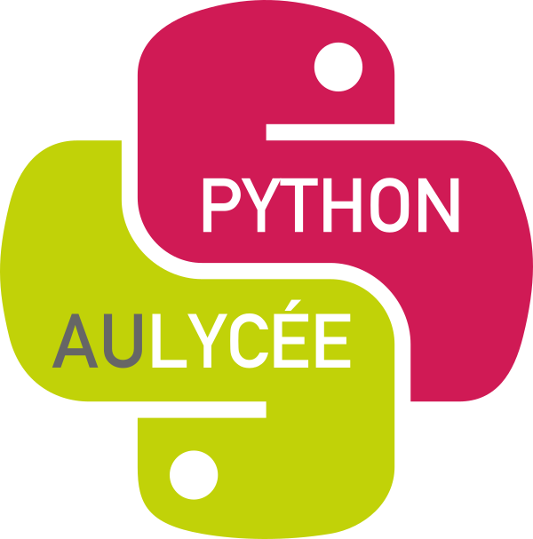

Python au lycée
===============

Python est le langage idéal pour apprendre la programmation.
C'est un langage puissant qui vous permettra de plonger dans le monde des algorithmes. 

Ce livre vous guide pas à pas à travers des activités mathématiques et informatiques originales adaptées au lycée. Il se complète par des ressources en ligne : des vidéos et des fiches en couleurs. 
Vous avez tout en main pour réussir !

Vidéos
======

Les vidéos seront visibles depuis la chaîne *Youtube* [Python au lycée](https://www.youtube.com/channel/UC6PiFyqBiUjiJ7Q3DRSW2Wg "www.youtube.com/PythonAuLycee").

Livre
=====

Le livre est en vente sur Amazon.fr à prix coûtant. [Commander le livre sur Amazon.fr]( https://www.amazon.fr/dp/1986820033).

Vous pouvez aussi le télécharger sur ce site : [Livre 'Python au lycée' (3 Mo)](livre-python1.pdf).

Activités
=========

* Premiers pas [Activités](premiers_pas/premiers_pas.pdf)
* Tortue (Scratch avec Python) [Activités](tortue/tortue.pdf)
* Si ... alors ... [Activités](sialors/sialors.pdf)
* Fonctions [Activités](fonctions/fonctions.pdf)
* Arithmétique -- Boucle tant que -- I [Activités](tantque/tantque-1.pdf)
* Chaînes de caractères -- Analyse d’un texte [Activités](chaines/chaines.pdf)
* Listes I [Activités](listes/listes-1.pdf)
* Statistique -- Visualisation de données [Activités](statistique/statistique.pdf)
* Fichiers [Activités](fichiers/fichiers.pdf)
* Arithmétique -- Boucle tant que -- II [Activités](tantque/tantque-2.pdf)
* Binaire I [Activités](binaire/binaire-1.pdf)
* Listes II [Activités](listes/listes-2.pdf)
* Binaire II [Activités](binaire/binaire-2.pdf)
* Probabilités -- Paradoxe de Parrondo [Activités](proba/proba.pdf)
* Chercher et remplacer [Activités](chercher/chercher.pdf)
* Calculatrice polonaise -- Piles [Activités](piles/piles.pdf)
* Visualiseur de texte -- Markdown [Activités](markdown/markdown.pdf)
* L-système [Activités](lsysteme/lsysteme.pdf)
* Images dynamiques [Activités](images/images.pdf)
* Jeu de la vie [Activités](vie/vie.pdf)
* Graphes et combinatoire de Ramsey [Activités](ramsey/ramsey.pdf)
* Bitcoin [Activités](bitcoin/bitcoin.pdf)
* Constructions aléatoires [Activités](aleatoire/aleatoire.pdf)

Guides
======

* Guide de survie Python [Guide](guide/guide-python.pdf)
* Principales fonctions [Guide](guide/guide-fonctions.pdf)
* Notes et références [Guide](guide/guide-biblio.pdf)

Codes
=====

Vous trouverez les fichiers sources en naviguant dans les répertoires de GitHub.

La totalité des codes est regroupée ici : [Code Python] (code/code.pdf)

Auteur
======

Arnaud Bodin

Rermciements à : Stéphanie Bodin, Michel Bodin, François Recher, Éric Wegrzynowski, Philippe Marquet, Kroum Tzanev.

Ce livre est diffusé sous la licence *Creative Commons -- BY-NC-SA -- 4.0 FR*.

